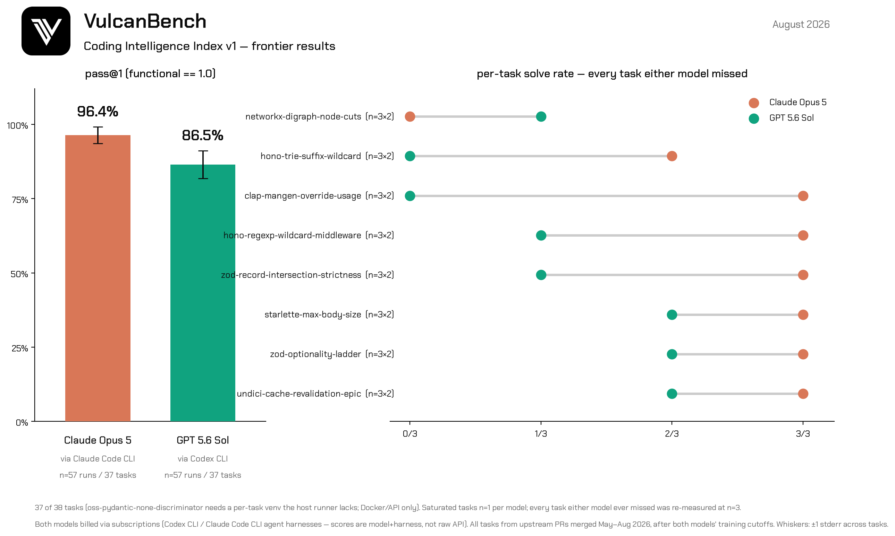

# CII v1 — frontier results (August 2026)

**VulcanBench Coding Intelligence Index v1**: 38 validated tasks, all sourced
from upstream open-source PRs merged **May–August 2026** — after the training
cutoffs of both models measured — with TerminalBench-style complexity-scaled
time budgets (30 min–8 h), hidden fail-to-pass tests plus regression guards
that zero the functional score on any regression, and a deterministic ×3
admission gate (gold = 1.0, pre-patch = 0.0).

## Headline

| model (agent harness) | pass@1 | mean functional | tasks | runs |
|---|---|---|---|---|
| **Claude Opus 5** (Claude Code CLI) | **96.4% ± 2.8** | 0.994 | 37 | 57 |
| **GPT 5.6 Sol** (Codex CLI) | **86.5% ± 4.7** | 0.962 | 37 | 57 |

Both billed via subscriptions; scores are **model + vendor harness**, not raw
API. The ~10-point gap is stable under repeat-3 on every task either model
missed (the aggregate ranking held at ~4 standard errors on the signal
subset).

## How to read this

- **The suite ranks frontier models; it does not ceiling them.** Only one
  task resists both models (`oss-networkx-digraph-node-cuts`: Opus 0/3,
  codex 1/3). Treat CII v1 as a mid-band suite and a cross-model
  discriminator, not a frontier-difficulty benchmark.
- **The discriminators are the product.** Four tasks separate the two models
  by ≥ 2 runs out of 3 (`clap-mangen-override-usage` 0/3 vs 3/3,
  `zod-record-intersection-strictness` 1/3 vs 3/3,
  `hono-regexp-wildcard-middleware`, `hono-trie-suffix-wildcard`), all in
  Opus 5's favor.
- **Per-task verdicts need n=3.** Single-run measurements flipped character
  on 4 of 5 re-measured tasks; aggregate rankings were stable at n=1, but
  per-task claims were not. Every task either model ever missed is reported
  at n=3 per model.
- **Speed/efficiency caveat**: Opus 5 used ≈3× the tokens and ≈1.7× the
  wall clock of GPT 5.6 Sol per task (16–38 agent turns vs 1–3) — a harness
  difference as much as a model one.

## Why there is no "hard tail" (and what we tried)

Ten difficulty hypotheses were tested, five under a formal frontier
admission gate (n=3 per candidate against both models, `scripts/frontier_gate.sh`):
architecture-scale features, hindsight traps from upstream regression pairs,
performance-gated tests with calibrated thresholds, multi-bug algorithmic
epics, and convention-heavy contracts (TypeScript index signatures, RFC 9111
caching, Postgres operator precedence). **Opus 5 solved 15/15 gated runs.**
In one instructive case it rewrote the algorithm from theory in 106 seconds
rather than finding the planted bugs. The full candidate log with per-run
scores is in [`tasks/cii-v2/CANDIDATES.md`](../../../tasks/cii-v2/CANDIDATES.md);
the v2 charter (difficulty-gated, currently empty pending a task-format
change) is in [`tasks/cii-v2/CHARTER.md`](../../../tasks/cii-v2/CHARTER.md).

## Coverage notes

- 37 of 38 tasks measured; `oss-pydantic-none-discriminator` requires a
  per-task virtualenv the host CLI runner doesn't provide (Docker/API only).
- Saturated tasks are n=1 per model; every task with any miss is n=3.
- Costs are hypothetical API-list prices (subscription-billed runs):
  ≈ $0.48/task (codex) vs ≈ $1.5–4/task (opus) on the measured sweeps.
- Regenerate the chart: `python scripts/cii-report/make_chart.py`
  (aggregates `./runs` directly).
